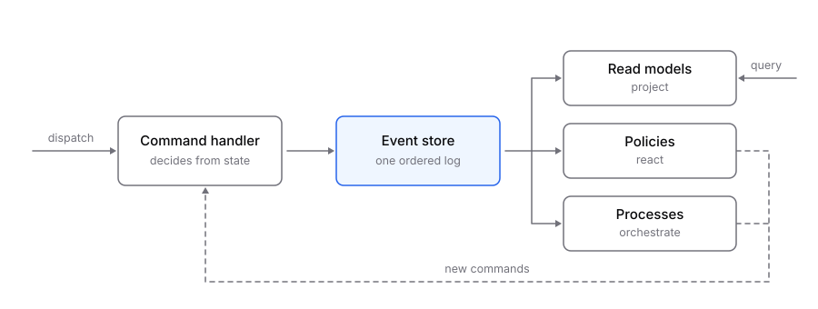

<p align="center">
  <picture>
    <source media="(prefers-color-scheme: dark)" srcset="docs/public/wordmark-dark.svg" />
    
  </picture>
</p>

<p align="center">Event sourcing and CQRS for TypeScript without the ceremony.</p>

<p align="center">
  <a href="https://www.npmjs.com/package/@bounda-dev/core"></a>
  <a href="https://github.com/bounda-dev/bounda/actions/workflows/ci.yml"></a>
  <a href="https://dashboard.stryker-mutator.io/reports/github.com/bounda-dev/bounda/main"></a>
  
  <a href="LICENSE"></a>
</p>

Bounda gives you aggregates, commands, events, policies, processes and read models through file
conventions and inferred types. Your business logic lives in small modules that export a handful
of functions. The runtime does the wiring and runs on a single database.

```bash
npm create bounda@latest my-app
```

Documentation: [docs.bounda.dev](https://docs.bounda.dev).

## What a slice looks like

A command decides, an event changes the state, a projection writes the row a query will read.
Three files, no registry to maintain:

```ts
// app/domain/order/commands/place-order.ts
import { DomainError } from "@bounda-dev/core";
import type { Command } from "./+types/place-order";

export const payload = ({ z }: Command.PayloadArgs) =>
  z.object({ orderId: z.uuid(), customerId: z.string().min(1), total: z.number().positive() });

export const handler = ({ command, state, events }: Command.HandlerArgs) => {
  if (state.status !== "new") {
    throw new DomainError(`Order ${command.aggregateId} was already placed`);
  }
  return [
    events.orderPlaced({ customerId: command.payload.customerId, total: command.payload.total }),
  ];
};
```

```ts
// app/domain/order/order-placed.ts
import type { Event } from "./+types/order-placed";

export const payload = ({ z }: Event.PayloadArgs) =>
  z.object({ customerId: z.string(), total: z.number().positive() });

export const apply = ({ state, event }: Event.ApplyArgs) => ({
  ...state,
  status: "placed" as const,
  customerId: event.payload.customerId,
  total: event.payload.total,
});
```

```ts
// app/read/orders/projections/order-placed.ts
import type { Projection } from "./+types/order-placed";

export const project = async ({ event, table }: Projection.Args) => {
  await table.upsert({
    orderId: event.aggregateId,
    customerId: event.payload.customerId,
    total: event.payload.total,
    placedAt: new Date(event.timestamp),
  });
};
```

Nothing is registered by hand: the file's place and name are the declaration. `bounda generate`
reads the layout and writes the `+types` modules next to it, so `command.payload` is typed from
the schema above it, `state` from the aggregate, `events` only offers this aggregate's events, and
`table` only the fields of this read model's view.

## How it runs

Every event a store holds gets a position in one global order. Read models, policies and
processes are subscribers of that log, with a checkpoint each, so a read model can be rebuilt and
a policy can be retried without touching the events. The
[how it runs](https://docs.bounda.dev/guides/how-it-runs/) guide has the numbers and the ceiling.

<p align="center">
  <picture>
    <source media="(prefers-color-scheme: dark)" srcset="docs/public/flow-dark.svg" />
    
  </picture>
</p>

## Status

Alpha. Every version on npm is a prerelease, so a plain install gets one; the API can change
between alphas without a deprecation cycle. Each package has its own changelog.

## In production

Roles for web and worker processes, any number of instances on PostgreSQL, a dispatcher woken by
`NOTIFY`, OpenTelemetry spans and metrics, `bounda rebuild` for a read model that went wrong,
`bounda dead-letters` for a policy that died, and upcasts for events whose payload changed. What
is not there yet, and why, is one list in the
[deployment guide](https://docs.bounda.dev/guides/deployment/#what-is-not-there-yet).

## Packages

| Package | Purpose |
|---|---|
| [`@bounda-dev/core`](packages/core) | Runtime and public API |
| [`@bounda-dev/cli`](packages/cli) | `bounda` CLI: reads the layout, writes the registry and the types |
| [`@bounda-dev/adapter-sqlite`](packages/adapter-sqlite) | SQLite and libSQL storage |
| [`@bounda-dev/adapter-postgresql`](packages/adapter-postgresql) | PostgreSQL storage |
| [`@bounda-dev/adapter-cloudflare`](packages/adapter-cloudflare) | A Durable Object per tenant on Cloudflare | none: its tests run inside workerd, where Stryker cannot mutate |
| [`@bounda-dev/react-router`](packages/react-router) | React Router integration and its Vite plugin |
| [`create-bounda`](packages/create-bounda) | Project scaffolder |

Each package README carries its own mutation score; the badge above is the whole repository.

Two examples live in this repository: [`examples/storefront`](examples/storefront) on Node and
SQLite, and [`examples/onboarding`](examples/onboarding) on React Router and PostgreSQL or SQLite.

## Development

Requires Node 22.18 or newer and pnpm 12.

```bash
pnpm install
pnpm check
```

`pnpm check` runs lint, build, generate, typecheck and tests across every package and example.
`pnpm --filter <package> test:mutation` runs Stryker on one package; CI runs it for the packages a
pull request touches.

## License

Apache 2.0. See [LICENSE](LICENSE).
